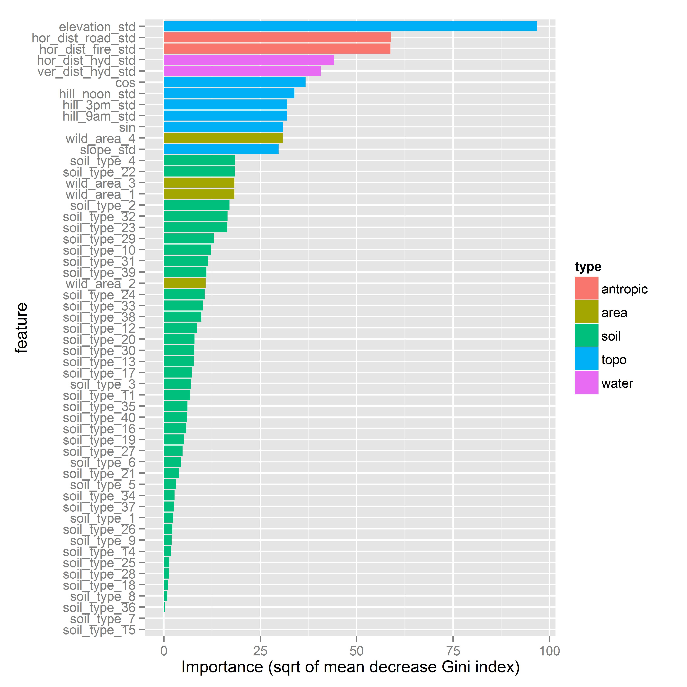

```{r,setting up the environment, echo = FALSE, include=FALSE}

if (!require("knitr")) install.packages("knitr")
if (!require("rmarkdown")) install.packages("rmarkdown")
if (!require("sjPlot")) install.packages("sjPlot")

opts_chunk$set(fig.width=8, fig.height=5, warning=FALSE, message=FALSE, 
               include=TRUE, echo=TRUE, cache=TRUE, cache.comments=FALSE)

if(!require("reshape2"))install.packages("reshape2")
if(!require("ggplot2"))install.packages("ggplot2")
if(!require("ggthemes"))install.packages("ggthemes")
if(!require("dplyr"))install.packages("dplyr")
if(!require("tidyr"))install.packages("tidyr")


source("code/library.R")
train <- get.train.data()
train.label <- train[[1]]
labels_df <- as.data.frame(train.label)
train.feat <- train[[3]]
```


# 0. Introduction and objectives

This report summarizes the statistical modeling and analysis of the Kaggle Competition for the prediction of the Forest covertype, a project which constitutes part of the Machine Learning class of Master of Data Science, BGSE. The purpose of the report
is to document both the implemented algorithms and data analysis perfomed together with the corresponding data modeling and inference techniques used during the subsequent statistical analyses. 

Data is related to forest species (7 of them) at Rossevelt Monument Park in the US, which have to be classified from 54 features related to its environment. 

# 1. The data

We have 50000 available observations for training, whereas prediction is done over 100000 new observations.

Here is a summary of the numeric feature data.


```{r, echo=FALSE, message=FALSE}
source("code/library.R")
train.data <- get.train.data()
labels <- as.factor(train.data[[1]])

features <- train.data[[2]]
features.std<-train.data[[3]]

```

`r sjt.df(features[,1:10], title="Summary of numeric feature data",alternateRowColors=TRUE,no.output=TRUE)$knitr`


Here is the heatmap related to the correlation matrix of these variables. 

Some hill and slope-aspect features are correlated, as one could expect. 


We have two kinds of binary data, one related to presence of particular soil type (40 binary soil_type special features present of not). Here is the contingency table by forest species class according to train data.

```{r echo=FALSE}
train<-data.frame(features,Cover_Type=as.factor(labels))
# Data per category
train<-tbl_df(train)
# Soil types vs cat
soil_cat<- train %>%
    group_by(Cover_Type) %>%
    summarise(
        sc1=sum(soil_type_1),
        sc2=sum(soil_type_2),
        sc3=sum(soil_type_3),
        sc4=sum(soil_type_4),
        sc5=sum(soil_type_5),
        sc6=sum(soil_type_6),
        sc7=sum(soil_type_7),
        sc8=sum(soil_type_8),
        sc9=sum(soil_type_9),
        sc10=sum(soil_type_10),
        sc11=sum(soil_type_11),
        sc12=sum(soil_type_12),
        sc13=sum(soil_type_13),
        sc14=sum(soil_type_14),
        sc15=sum(soil_type_15),
        sc16=sum(soil_type_16),
        sc17=sum(soil_type_17),
        sc18=sum(soil_type_18),
        sc19=sum(soil_type_19),
        sc20=sum(soil_type_20),
        sc21=sum(soil_type_21),
        sc22=sum(soil_type_22),
        sc23=sum(soil_type_23),
        sc24=sum(soil_type_24),
        sc25=sum(soil_type_25),
        sc26=sum(soil_type_26),
        sc27=sum(soil_type_27),
        sc28=sum(soil_type_28),
        sc29=sum(soil_type_29),
        sc30=sum(soil_type_30),
        sc31=sum(soil_type_31),
        sc32=sum(soil_type_32),
        sc33=sum(soil_type_33),
        sc34=sum(soil_type_34),
        sc35=sum(soil_type_35),
        sc36=sum(soil_type_36),
        sc37=sum(soil_type_37),
        sc38=sum(soil_type_38),
        sc39=sum(soil_type_39),
        sc40=sum(soil_type_40)
    )
soil_cat<-as.data.frame(t(soil_cat))
```

`r sjt.df(soil_cat, title="Summary of soil feature data",describe=FALSE,alternateRowColors=TRUE,no.output=TRUE)$knitr`


There's a common overlap between classes 1 and 2 in some soil types.


On the other hand, the other class of binary variable is the particular natural area where the observation was taken (4 different areas). Here is the contingency table.

```{r echo=FALSE}
# Soil types vs cat
area_cat<- train %>%
    group_by(Cover_Type) %>%
    summarise(
        area1=sum(wild_area_1),
        area2=sum(wild_area_2),
        area3=sum(wild_area_3),
        area4=sum(wild_area_4)
    )
area_cat<-as.data.frame(t(area_cat))
```

`r sjt.df(area_cat, title="Summary of forest species by natural area",describe=FALSE,alternateRowColors=TRUE,no.output=TRUE)$knitr`


There are some species that are not present in some natural areas.


# 2. Data Preprocessing

## Standarization

We first separated the labels from the features. 

Two standardization procedures were conducted for the continuous variables (1-10):

1. Center the data around the mean and divided by the standard deviation.
2. Rescale the data from -1 to 1. In particular, aspect feature was splited to sin and cos to reach this objective.

We now have three versions of features, both for test and training features
1. Raw - No changes to features 
2. Standardised - Continuius variables are centered around sample mean and divided by sample standard deviation. Aspect converted to sin and cos.
3. Scaled - Continuous variables are scaled from -1 to 1

## Principal Componenent Analysis (PCA)

PCA was also used as part of the Data preprocessing and exploratory analysis in order to 

Principal Component Analysis (PCA) is implemented in order to check whether there are redundant features which do not contribute to the variability of the data and thus achieve dimensionality reduction of our data. The steps followed for the implementation of the PCA were the following:

1. Standardize the values of the features - a necessary procedure for conducting PCA
2. PCA and binary data: The literature is quite ambiguous about this topic, although it seems like the specific technique is appropriate for handling binary (categorical) datacombined with other (continuous valued) features. when standardized.
3. Apply the prcomp function which conducts the calculation by taking the singular value decomposition of the covariance matrix of the features.
4. Retain a ~99% level of  variability of our initial data.
5. Use the Random Forest method on the reduced data.

As an outcome, just the first 26 PCA features (out of 55) capture 99% of the variability. The following graph shows accumulated variance along PCA features.

```{r, echo=FALSE}

pca<-prcomp(train.feat)
train.feat<-pca$x
vectors<-pca$rotation
var<-diag(cov(train.feat))/sum(diag(cov(train.feat)))
cumvar<-cumsum(var)
barplot(cumvar,main="Accumulated variance",xlab="PCA features")
nvars<-sum(cumvar<0.99)

```

Nevertheless, we tried modeling random forest with these 26 features, and accuracy was not increased.


# 3. Modelling

There were different models tried and the parameters were optimized for each method using the AWS. More specificcally, best results were obtained with:

## I. K-NN model 

We implemented the K-NN algorithm for all the odd cases between k=1-21 by using both the standardized and the raw data in order to check which formulation gives the higher accuracy. In the end it turned out that the 1-NN method provides the best results, as it is depicted in the figures below. 


```{r, echo=FALSE}
comparison <- read.csv(file = "data/knn/knn_data_error.csv", header = T)[,-1]


#melt daa for graph
comparison.long <- melt(data = comparison, id.vars = "k", 
                        measure.vars = c("raw.feat.err", "std.feat.err"),
                        variable.name = "feature_type", value.name = "error")

plot1 <- ggplot(data = comparison.long, aes(x = k,y = error, color = feature_type )) +
  geom_line(size = 0.5) + 
  geom_point(size = 3) + 
  scale_x_continuous(breaks= seq(1,21,2)) + 
  ggtitle("k error (raw vs std features)") +
  scale_color_wsj(name  ="Feature Type", labels=c("Raw", "Standardised"))
plot1
```


## II. Kernalised Support Vector Machine model

We also tried radial kernalised support vector machines. The challange was to optimise
the cost parameter and the gamma (for the kernel) parameter.

Features used : rescaled (-1, +1 range needed).

We performed a grid search over some combinations of cost and gamma and get the 
following results

```{r,echo = FALSE}
res <- read.csv(file = "data/svm/coarse_grid_errors.csv", header = T)
res
```

Although the results are cross validated for k = 10, we cannot help but suspect that
there might be overfitting involved. Indeed testing parameters that gave zero error returned comparitively high errors on the test data.

To further tune our parameters, we chose the gamma and cost corresponding to the eighth row and tried to optimise the paramerets further around `cost = 512` and
`gamma = .5`, parameters that gave us the best test error.

```{r,echo = FALSE}
fig <- read.csv(file = "data/svm/fine_grid_errors.csv")[,-1]
fig

```

However, despite the encouraging training errors, we could only manage a best
test error of around 15%, no less than we got from the broad grid search.


## III. Random forests

### General setup

Random forest classification is based on an extension of classification trees. Each step, a bagged sample from the data is used, and a subset of the data features are used. This proportion of features to be used can be tuned using the `mtry` parameter at the `randomForest` function of `randomForest` R package.

So we tuned this parameter to optimize the performance of the classification. Note that no cross-validation is needed in random forest, because it's internally done using the Out of Bag samples, thus, data not used at each step of the tree.
We used the standarized version of input data, as explained before.

### Results

Here is the comparing performance using different `mtry` values.


From mtry around 30, general error gets almost stabilized arround 10%. The automatic procedure picked up mtry=39. Recall we have 54 features in total, 44 of them binary factors related to soil and area types. Note classes 4 and 5 yield higher error than the other, but don't affect that much overall error, since they are minority in percent.

Accuracy didn't improve if we just try around 26 features corresponding to first 26 eigenvectors from principal compoment analysis, so we decided to preserved the original data.

Different variations of random forest classifier were tried. For instance, previously processing PCA, and classifying over PCA features with added variance 99% didn't result in improved accuracy.

Tuning the `ntree` parameter didn't improve the accuracy. As shown in next graphic, the standard ntree=500 already implies a maximum accuracy.


### Analysis

Importance of measures can be shown by mean decrease of Gini coefficient.
As we can see from the results in the following graph (squared root of values showed to improve visualization), **elevation** is by far the most importance feature to classify this forest species, which is an expected result, from the ecological point of view. Considering that we are talking about nearby habitats, elevation is the main driver that determines overall local habitat to develop a particular species.



Some antropic and water-related features are also important, and then we have 5 features all inter-related: hillshade (3), aspect (sin,cos) and slope. These determine the micro-habitat in terms of light exposure and basic substract (slope is also related to fertility/erosion). If we add all its values, they're even bigger than elevation feature, which is also a reasonable result from the habitat point of view.

Finally, we can split the accuracy in terms of forest species. The so-called confusion matrix is the following:

```{r createtable, results='asis', echo=FALSE, message=FALSE}
table<-read.csv("data/rfor_confusion.csv")
table<-as.data.frame(table)
table<-table[,-1]
names(table)<-c(1:7,"Classif.Error")
table[,8]<-round(table[,8],3)
``` 

`r sjt.df(table, alternateRowColors=TRUE,describe=FALSE,no.output=TRUE)$knitr`

As we can see, the bigger error counts (in number) happen between classes 1 and 2, although the classification error is among the lowest (6 and 12%). On the other hand, classes 4 and 5, which are minority, are poorly classified, but its effect in overall performance is not that important.


# 4. Prediction

Since we have several models that perform around 90% accuracy, we decided to do last submission with a majority vote, through a weighted average of classification of the three models. The weights are the test-accuracy reported for the predicted class.


# 5. Conclusions

Forest cover classification is a tricky question, since probably data is not separable. This arises from the ecological habitat adaptation of the species, that lead naturally to an overlaping ecological habitat defined by the features. Thus, in many similar habitat, more than one species can live. 

This is particularly true for the majority species: fir and lodgepole pine, that concentrate the larger number or missclassification error. In contrast, minority species concentrate higher percentage of missclassification error, probably because there's less data to model them.

Nevertheless, the ensemble of models used lead to a quite close classification, that could probably be improved by detailed study, such as focusing on soil type, that probably could prevent some species to belong to that habitat. Also focusing on the relative distribution of species per natural area.
