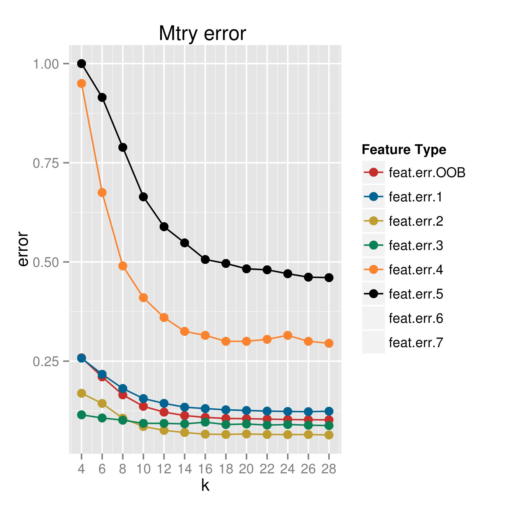
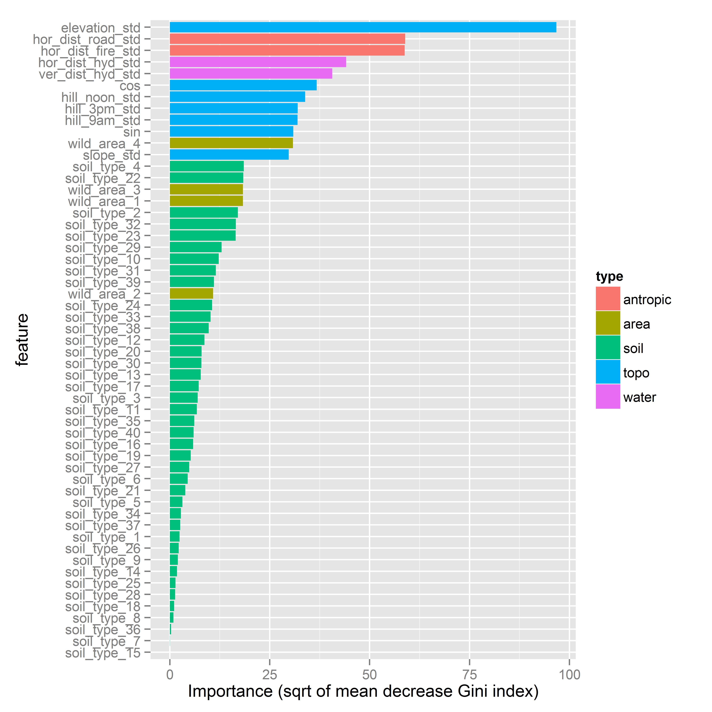

```{r, echo=FALSE, message=FALSE}
options(warn=-1)
require("sjPlot")

```

# Exploratory analysis

Main summary of feature data.

```{r, echo=FALSE, message=FALSE}
source("code/library.R")
train.data <- get.train.data()
labels <- as.factor(train.data[[1]])

features <- train.data[[2]]
features.std<-train.data[[3]]

```

`r sjt.df(features, title="Summary of feature data",alternateRowColors=TRUE,no.output=TRUE)$knitr`
`r sjt.pca(features2, title="Summary of PCA", alternateRowColors=TRUE,no.output=TRUE)$knitr`

# Random forest

# General setup
Random forest classification is based on an extension of classification trees. Each step, a bagged sample from the data is used, and a subset of the data features are used. This proportion of features to be used can be tuned using the `mtry` parameter at the `randomForest` function of `randomForest` R package.
So we tuned this parameter to optimize the performance of the classification. Note that no cross-validation is needed in random forest, because it's internally done using the Out of Bag samples, thus, data not used at each step of the tree.
We used the standarized version of input data, as explained before.

# Results
Here is the comparing performance using different `mtry` values.



From mtry around 20, general error gets almost stabilized arround 10%. Recall we have 54 features in total, 44 of them binary factors related to soil and area types. Note classes 4 and 5 yield higher error than the other, but don't affect that much overall error, since they are minority in percent.
Accuracy didn't improve if we just try around 30 features corresponding to first 30 eigenvectors from principal compoment analysis, so we decided to preserved the original data.

# Analysis
Importance of measures can be shown by mean decrease of Gini coefficient.
As we can see from the results in the following graph (squared root of values showed to improve visualization), **elevation** is by far the most importance feature to classify this forest species, which is an expected result, from the ecological point of view. Considering that we are talking about nearby habitats, elevation is the main driver that determines overall local habitat to develop a particular species.



Some antropic and water-related features are also important, and then we have 5 features all inter-related: hillshade (3), aspect (sin,cos) and slope. These determine the micro-habitat in terms of light exposure and basic substract (slope is also related to fertility/erosion). If we add all its values, they're even bigger than elevation feature, which is also a reasonable result from the habitat point of view.

Finally, we can split the accuracy in terms of forest species. The so-called confusion matrix is the following:

```{r createtable, results='asis', echo=FALSE, message=FALSE}
table<-read.csv("data/rfor_confusion.csv")
table<-as.data.frame(table)
table<-table[,-1]
names(table)<-c(1:7,"Classif.Error")
table[,8]<-round(table[,8],3)
``` 

`r sjt.df(table, alternateRowColors=TRUE,describe=FALSE,no.output=TRUE)$knitr`
As we can see, the bigger error counts (in number) happen between classes 1 and 2, although the classification error is among the lowest (6 and 12%). On the other hand, classes 4 and 5, which are minority, are poorly classified, but it's effect in overall performance is not that important.


